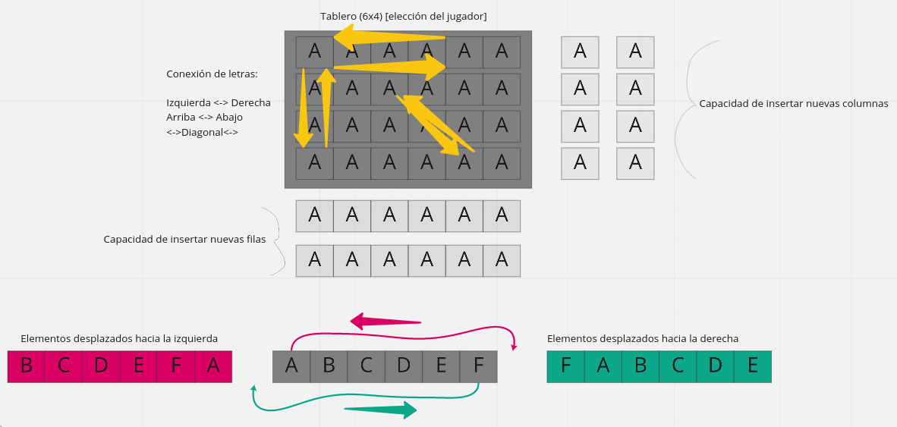

# Proyecto #1 de Estructuras de Datos

## Integrantes

- *Juan Antonio González Orbe*
  - `juangonz@espol.edu.ec`
  - **GitHub**: `anntnzrb`

- *Steven Guillermo Encalada Pincay*
  - `sencalad@espol.edu.ec`
  - **GitHub**: `STEVEN2199`

- *Stefany Natalia Farias Mera*
  - `snfarias@espol.edu.ec`
  - **GitHub**: `stefanyfariasm`

## Concepto

Link a [Miro](https://miro.com/welcomeonboard/bjJYN0hsbGM4RXE2aVpWemV0SFk5a1Nsa3ZTeWlHS1lVeVZLUlYzaTlneHhTS1NINE0xRGh0WU1vTUN1Z0VvT3wzMDc0NDU3MzYwMDIyMTAxNjk3?invite_link_id=799343242027)
